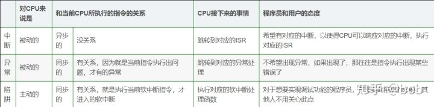
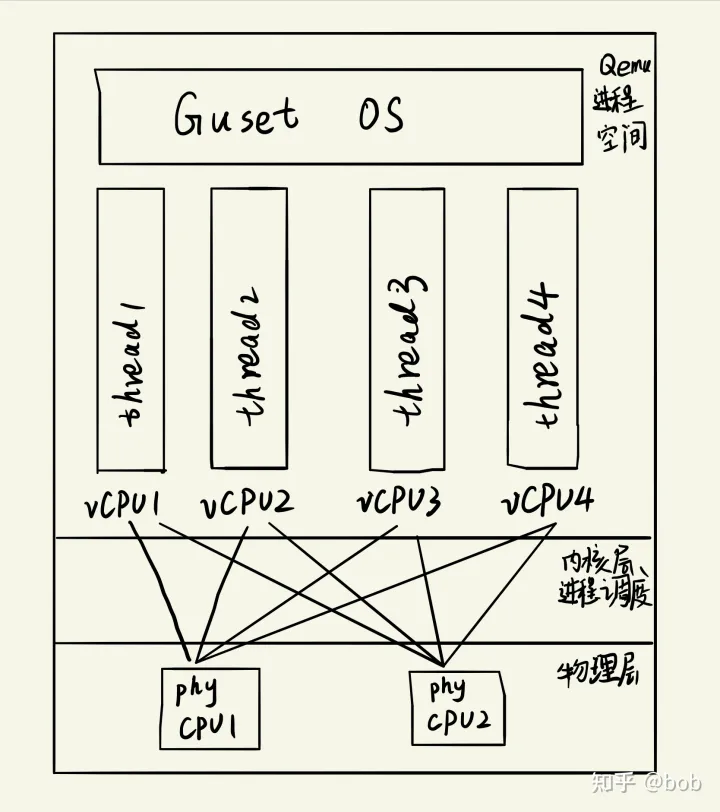

# CPU虚拟化

## 虚拟CPU带来的问题

`x86`处理器提供 `ring0~ring3`四个特权级别给操作系统和应用程序来访问硬件，`ring0`权限最高，`ring3`权限最低：

* 操作系统（内核）需要直接访问硬件和内存，因此它的代码需要运行在最高运行级别 `ring0`上，这样它可以使用特权指令，控制中断、修改页表、访问设备等等。
* 应用程序的代码运行在最低运行级别上 `ring3`上，不能做受控操作。如果要做，比如要访问磁盘，写文件，那就要通过执行系统调用，执行系统调用的时候，CPU的运行级别会发生从 `ring3`到 `ring0`的切换，并跳转到系统调用对应的内核代码位置执行，这样内核就为你完成了设备访问，完成之后再从 `ring0`返回 `ring3`。这个过程也称作用户态和内核态的切换。

**虚拟CPU在这里遇到一个难题，因为 `Host OS`是工作在 `ring0`的，`Guest OS`就无法也在 `ring0`了，但是 `Guest OS`本身不知道这一点，以前执行访问设备等特权指令，现在还是执行特权指令，但是没有执行权限肯定会出错。**

虚拟机怎么通过 `VMM/Hypervisor`实现 `Guest CPU`对硬件的访问，根据其原理不同有三种实现技术：

1. 全虚拟化/`Full-Virtualization`
2. 半虚拟化/`Para-Virtualization`
3. 硬件辅助的全虚拟化

## **基于二进制翻译的全虚拟化**

客户操作系统运行在 `ring1`，它在执行特权指令时，会触发CPU异常(`Exception`)，然后 `VMM`捕获这个异常，在异常里面做翻译，模拟，最后返回到客户操作系统内，客户操作系统认为自己的特权指令工作正常，继续运行。但是这个性能损耗非常的大，简单的一条指令，本来执行完结束，现在却要通过复杂的异常处理过程。

异常 `Exception`(内中断)，中断 `Interrupt`(外中断)，陷阱 `Trap`(软中断)的区别：



## **半虚拟化**

半虚拟化的思想是：修改操作系统内核，替换掉不能虚拟化的指令，通过超级调用(`hypercall`)直接和底层的虚拟化层 `Hypervisor`来通讯，`Hypervisor`同时也提供了超级调用接口来满足其他关键内核操作，比如内存管理、中断和时间保持。

这种做法省去了全虚拟化中的捕获和模拟，大大提高了效率。所以像 `Xen`这种半虚拟化技术，客户机操作系统都是有一个专门的定制内核版本，和 `x86`、`mips`、`arm`这些内核版本等价。这样以来，就不会有捕获异常、翻译、模拟的过程了，性能损耗非常低。这就是 `Xen`这种半虚拟化架构的优势。这也是为什么 `Xen`只支持虚拟化 `Linux`，无法虚拟化 `windows`原因，因为微软不改代码。

## **硬件辅助的全虚拟化**

2005年后，`CPU`厂商 `Intel`和 `AMD`开始支持虚拟化了。`Intel`引入了 `Intel-VT(Virtualization Technology)`技术。 这种 `CPU`，有 `VMX root operation`和 `VMX non-root operation`两种模式，两种模式都支持 `ring0~ring3`共4个运行级别。这样，`VMM`可以运行在 `VMX root operation`模式下，`Guest OS`运行在 `VMX non-root operation`模式下。

而且两种操作模式可以互相转换。运行在 `VMX root operation`模式下的 `VMM`通过显式调用 `VMLAUNCH`或 `VMRESUME`指令切换到 `VMX non-root operation`模式，硬件自动加载 `Guest OS`的上下文，于是 `Guest OS`获得运行，这种转换称为 `<b>VM entry</b>`。`Guest OS`运行过程中遇到需要 `VMM`处理的事件，例如外部中断或缺页异常，或者主动调用 `VMCALL`指令调用 `VMM`的服务的时候(与系统调用类似)，硬件自动挂起 `Guest OS`，切换到 `VMX root operation`模式，恢复 `VMM`的运行，这种转换称为 `<b>VM exit</b>`。`VMX root operation`模式下软件的行为与在没有 `VT-x`技术的处理器上的行为基本一致；而 `VMX non-root operation`模式则有很大不同，最主要的区别是此时运行某些指令或遇到某些事件时，发生 `VM exit`。

也就说，硬件这层就做了些区分，这样全虚拟化下，那些靠**捕获异常-翻译-模拟**的实现就不需要了。而且CPU厂商，支持虚拟化的力度越来越大，靠硬件辅助的全虚拟化技术的性能逐渐逼近半虚拟化，再加上全虚拟化不需要修改客户操作系统这一优势，全虚拟化技术应该是未来的发展趋势。

|                         | 利用二进制翻译的全虚拟化           | 硬件辅助虚拟化                                                                        | 操作系统协助/半虚拟化                                                                                          |
| ----------------------- | ---------------------------------- | ------------------------------------------------------------------------------------- | -------------------------------------------------------------------------------------------------------------- |
| 实现技术                | BT和直接执行                       | 遇到特权指令转到root模式执行                                                          | Hypercall                                                                                                      |
| 客户操作系统修改/兼容性 | 无需修改客户操作系统，最佳兼容性   | 无需修改客户操作系统，最佳兼容性                                                      | 客户操作系统需要修改来支持hypercall，因此它不能运行在物理硬件本身或其他的hypervisor上，兼容性差，不支持Windows |
| 性能                    | 差                                 | 全虚拟化下，CPU需要在两种模式之间切换，带来性能开销；但是，其性能在逐渐逼近半虚拟化。 | 好。半虚拟化下CPU性能开销几乎为0，虚机的性能接近于物理机。                                                     |
| 应用厂商                | VMware Workstation/QEMU/Virtual PC | VMware ESXi/Microsoft Hyper-V/Xen 3.0/KVM                                             | Xen                                                                                                            |

# **KVM的CPU虚拟化**

## **vCPU概述**

```bash
qemu-kvm通过对/dev/kvm的一系列ioctl命令来控制虚拟机和监视虚拟机的状态，例如：
int kvmfd = open("/dev/kvm", O_RDWR|O_LARGEFILE);
ret = ioctl(kvmfd, KVM_GET_API_VERSION, 0);
int vmfd = ioctl(kvmfd, KVM_CREATE_VM, 0);   
int vcpufd = ioctl(vmfd, KVM_CREATE_VCPU, 0);
```

一个 `KVM`虚拟机即一个Linux `qemu-kvm`进程，与其他Linux进程一样被Linux进程调度器调度。

`KVM`虚拟机包括虚拟内存、虚拟CPU和虚机 I/O设备，其中，内存和 `CPU`的虚拟化由 `KVM`内核模块负责实现，I/O设备的虚拟化由 `Qwmu`负责实现。

`KVM`户机系统的内存是 `qemu-kvm`进程的地址空间的一部分。

`KVM`虚拟机的 `vCPU`作为线程运行在 `qemu-kvm`进程的上下文中。

`vCPU`、`Qemu`进程、Linux进程调度和物理CPU之间的逻辑关系：



通过上面的学习已经得知 `kvm`属于硬件辅助的全虚拟化，由于支持虚拟化的 `CPU`中都增加了新的功能。以 `Intel-VT`技术为例，它增加了两种运行模式：`VMX root`模式和 `VMX non-root`模式。通常来讲，`Host OS`和 `VMM`运行在 `VMX root`模式中，`Guest OS`及其应用运行在 `VMX non-root`模式中。因为两个模式都由各自的 `ring0~ring3`，因此，客户机可以运行在它所需要的 `ring`中(OS运行在 `ring0`，应用运行在 `ring3`中)，`VMM`也运行在其需要的 `ring`中(对 `KVM`来说，`QEMU`运行在 `ring3`，`KVM`运行在 `ring0`)。`CPU`在两种模式之间的切换称为 `VMX`切换。 **从 `root mode`进入 `non-root mode`，称为 `VM entry`；从 `non-root mode`进入 `root mode`，称为 `VM exit`。可见，`CPU`受控制地在两种模式之间切换，轮流执行 `VMM code`和 `Guest OS code`** 。

对 `KVM`虚拟机来说，运行在 `root mode`下的 `VMM`在需要执行 `Guest OS`指令时执行**`VMLAUNCH/VMRESUME`指令**将 `CPU`转换到 `non-root mode`，开始执行客户机代码，即 `VM entry`过程；在 `Guest OS`需要退出 `non-root mode`时(主动调用** `VMCALL`指令**或者遇到外中断或者遇到缺页等异常)，`CPU`自动切换到 `root mode`，即 `VM exit`过程。**可见，`KVM`** **客户机代码是受 `VMM`控制直接运行在物理 `CPU`上的。`Qemu`只是通过 `KVM`控制虚机的代码被 `CPU`执行，但是它们本身并不执行其代码。也就是说，`CPU`并没有真正的被虚拟化成虚拟的 `CPU`给客户机使用。**

几个概念：

* `socket`：颗，插入 `CPU`的个数。
* `core`：核，每个 `CPU`中的物理内核。
* `thread`：超线程，通常来说，一个 `CPU core`只提供一个 `thread`，这时客户机就只看到一个 `CPU`；但是，超线程技术实现了 `CPU`核的虚拟化，一个核被虚拟化出多个逻辑 `CPU`，可以同时运行多个线程。

所以一个 `kvm`虚拟机的 `vCPU`数目为 `thread*core*socket`，例如 `-smp 5,sockets=5,cores=1,threads=1`，所以 `vCPU`数目为 `5`，`vCPU`作为 `QEMU`线程被 `Linux`作为普通的线程/轻量级进程调度到物理的 `CPU`核上。(关于 `-smp`：[-smp用法](https://link.zhihu.com/?target=https%3A//zhensheng.im/2015/11/22/qemu-smp%25E5%258F%2582%25E6%2595%25B0%25E8%25A7%25A3%25E9%2587%258A%25E5%258F%258A%25E5%259C%25A8libvirt%25E4%25B8%25AD%25E7%259A%2584%25E8%25AE%25BE%25E7%25BD%25AE%25E5%25A4%259Acpu-%25E5%25A4%259A%25E6%25A0%25B8%25E5%25BF%2583.meow.html)

## **Guest模式**

一个普通的 `Linux`内核有两种执行模式：内核模式和用户模式。为了支持带有虚拟化功能的 `CPU`，`KVM`向 `Linux`内核增加了第三种模式即客户机模式 `Guest`，该模式对应于 `CPU`的 `VMMX non-root mode`。

`KVM`内核模块作为 `User mode`和 `Guest mode`之间的桥梁：

* `User mode`中的 `Qemu-kvm`会通过 `ioctl`命令来运行虚拟机。
* `KVM`收到该请求后，它先做一些准备工作，比如将 `vCPU`上下文加载到 `VMCS(virtual machine control structure)`等，然后驱动 `CPU`进入 `VMX non-root`模式，开始执行客户机代码。

三种模式的分工为：

* `Guest`模式：执行客户机系统非 `I/O`代码，并在需要的时候驱动 `CPU`退出该模式。
* `Kernel`模式：负责将 `CPU`切换到 `Guest mode`执行 `Guest OS`代码，并在 `CPU`退出 `Guest mode`时回到 `Kenerl`模式，将客户机的 `I/O`请求转发给 `User`模式让 `Qemu`完成。
* `User`模式：用 `ioctl(/dev/kvm)`与 `kvm`交互，代替客户机系统执行 `I/O`操作。

`Qemu-KVM`相比原生 `Qemu`的改动：

* 原生的 `Qemu`通过指令翻译实现 `CPU`的完全虚拟化，但是修改后的 `Qemu-KVM`会调用 `ioctl`命令来调用 `KVM`模块。
* 原生的 `Qemu`是单线程实现，`Qemu-KVM`是多线程实现。

主机 `Linux`将一个虚拟视作一个 `Qemu`进程，该进程包括下面几种线程：

* `I/O`线程用于管理模拟设备。
* `vCPU`线程用于运行 `Guest`代码。
* 其它线程，比如处理 `event loop`，`offloaded tasks`等的线程。

# Qemu

Qemu可以看成一款虚拟机，他可以模拟很多CPU架构。比如Alpha, ARM, Cris, i386, M68K, PPC, Sparc, [Mips](https://so.csdn.net/so/search?q=Mips&spm=1001.2101.3001.7020)等；以及大部分的硬件设备，也就可以模拟出不同的目标系统。

QEMU用途广泛，比如Xen、Android模拟器等都是基于QEMU的。
在嵌入式领域，很多人使用QEMU来深研Linux，比如研究文件系统、优化等等。

# Qemu主要原理与机制

Qemu可以实现目标平台的仿真，但是arm平台的程序怎么能在我们电脑上运行呢？这是Qemu主要要做的事情，翻译，那如何进行翻译呢。大致上就是下面这样：

客户代码 ——>中间代码 ——> 主机代码

那就会有人问了为什么要转换成中间代码，直接转换成主机代码不香吗？问得好。
在Qemu中执行翻译这部分流程的是TCG模块，因为Qemu是支持跨平台的，他不仅可以在linux下执行arm的程序还可以在ppc下等等不同的平台下执行，这里为了通用性方面的考虑，先转换成中间代码，在将中间代码转换成主机代码。

## Qemu的两种运行模式

Qemu 有两种运行模式，一种是全系统模拟（system mde），一种是用户态模拟(user mode)。
 从名字就可以看出来system mode肯定是模拟全了，可以直接跑操作系统之类的。user mode肯定就弱一点，跑个进程之类的。

# 安装qemu

如果需要构建KVM环境，首先需要硬件支持。

首先处理器（CPU）要在硬件上支持VT技术，还要在BIOS中将其功能打开，KVM才能使用到。目前，多数流行的服务器和部分桌面处理器的BIOS都默认将VT打开了。

在BIOS中，VT的选项通过“Advanced→Processor Configuration”来查看和设置，它的标识通常为“Intel®Virtualization Technology”或“Intel VT”等类似的文字说明。

设置好了VT和VT-d的相关选项，保存BIOS的设置并退出，系统重启后生效。在Linux系统中，可以通过检查/proc/cpuinfo文件中的CPU特性标志（flags）来查看CPU目前是否支持硬件虚拟化。在x86和x86-64平台中，Intel系列CPU支持虚拟化的标志为“vmx”，AMD系列CPU的标志为“svm”。所以可以用以下命令行查看“vmx”或者“svm”标志：

```bash
grep -E "svm|vmx" /proc/cpuinfo
```

## 安装KVM

KVM作为Linux kernel中的一个module而存在，是从Linux 2.6.20版本开始被完全正式加入内核的主干开发和正式发布代码中。所以，只需要下载2.6.20版本，Linux kernel代码即可编译和使用KVM。

总的来说，下载最新KVM源代码，主要有以下3种方式：
 1）下载KVM项目开发中的代码仓库kvm.git。
 2）下载Linux内核的代码仓库linux.git。
 3）打包下载Linux内核的源代码（Tarball 格式）。

首先查看系统是否加载了kvm模块

```bash
lsmod | grep kvm
```

安装qemu有两种方式，一种为源码安装，一种直接 `apt/yum/dnf`安装。

## 源码安装

参考官方步骤：[https://www.qemu.org/download/](https://www.qemu.org/download/)

1. 下载QEMU源码
2. 解压
3. configure

```bash

wget https://download.qemu.org/qemu-7.2.0.tar.xz
tar -xvJf qemu-7.2.0.tar.xz
cd qemu-7.2.0
# 加入KVM
./configure --prefix=/opt/qemu --enable-debug --target-list=x86_64-softmmu --enable-kvm
# --prefix 选项设置qemu的安装位置，之后若要卸载删除qemu只要删除该文件夹即可
# config完，可以在指定的qemu安装文件夹下面找到config-host.mak文件，
# 该文件记录着qemu配置的选项，可以和自己设置的进行对比，确保配置和自己已知
make
sudo make install
```

### deepin上安装

使用源码编译好像并未成功

```
sudo apt install qemu-system qemu-kvm
```

QEMU运行的速度及其慢，为了解决这个问题，可以使用[KVM](https://so.csdn.net/so/search?q=KVM&spm=1001.2101.3001.7020)，它是内核层面对虚拟话的支持。
 需要安装qemu-kvm

### 安装工具安装

```bash
sudo apt install virt-manager virt-viewer libvirt-dev libvirt-clients libvirt-daemon libvirt-daemon-system
```

- qemu-kvm：qemu模拟器
- qemu-img：qemu磁盘image管理器
- libvirt：提供libvirtd daemon来管理虚拟机和控制hypervisor
- libvirt-client：提供客户端API用来访问server和提供管理虚拟机命令行工具的virsh实体
- virt-viewer：图形控制台

其中最重要的是qemu-kvm、qemu-img，同时为了方便管理虚拟机，最好安装上libvirt  。

安装完qemu后，在/usr/bin/目录下会有qemu开头的若干可执行程序，
类似qemu-x86_64这种命令是运行某种架构的程序的，qemu-system-x86_64是运行某种架构系统的（虚拟机），如果需要kvm支持，需要加上参数
 -enable-kvm， 如果使用libvirt可以配置相应的xml来实现kvm支持。

# QEMU使用

## 创建虚拟机

### 创建镜像

```bash
qemu-img create -f qcow2 XXX.qcow2 10G
```

### 创建虚拟机

```bash
qemu-system-x86_64 -enable-kvm -name "XXX" -m 1024 -smp 2 -boot d -drive file=XXX.qcow2,if=virtio,index=0,media=disk,format=qcow2 -drive file=YYY.iso,index=1,media=cdrom
```

创建之后通过vnc连接到安装界面，之后便可进行安装

### 启动虚拟机

```bash
# 未开启kvm支持，使用标准输入作为 QEMU monitor 命令源
./qemu-system-x86_64 -m 1024 -hda XXX.qcow2 -usb -usbdevice tablet -vnc :51 -monitor stdio
# 开启kvm支持，使用标准输入作为 QEMU monitor 命令源
./qemu-system-x86_64 --enable-kvm -m 1024 -hda XXX.qcow2 -usb -usbdevice tablet -vnc :51 -monitor stdio
# gdb调试
gdb --args ./qemu-system-x86_64 -m 1024 -hda XXX.qcow2 -usb -usbdevice tablet -vnc :51
```

## 命令选项

### qemu的标准选项

```bash
# qemu的标准选项主要涉及指定主机类型、CPU模式、NUMA、软驱设备、光驱设备及硬件设备等。
-name name		# 虚拟机名称
-M machine		# 指定要模拟的主机类型，如standard PC，ISA-only PC或Intel-Mac等，可以使用“qemu-kvm -M ?”获取所支持的所有类型
-m megs			# 设定虚拟机的RAM大小
-cpu model		# 设定CPU模型，如coreduo、qemu64等，可以使用"qemu-kvm -cpu ?"获取所支持的所有模型
-smp n			# 设定模拟的SMP架构中CPU的个数
    [,cores=cores]		# 每个CPU的核心数
    [,threads=threads]  # 线程数
    [,sockets=sockets]  # CPU的socket数目
    [,maxcpus=maxcpus]  # 用于指定热插入的CPU个数上限
-numa   非一致内存访问
-numa opts：指定模拟多节点的numa设备
 
-fda file：
-fdb file：使用指定文件(file)作为软盘镜像，file为/dev/fd0表示使用物理软驱
-hda file：
-hdb file：
-hdc file：
-hdd file：使用指定file作为硬盘镜像
-cdrom file：使用指定file作为CD-ROM镜像，需要注意的是-cdrom和-hdc不能同时使用：将file指定为/dev/cdrom可以直接使用物理光驱
 
-drive						# 定义一个硬盘设备：可用子选项有很多
    file=/path/to/somefile	# 硬盘映像文件
    if=interface			# 硬盘设备接口类型 ide、scsi、sd、virtio（半虚拟化）
    index=index				# 设定同一种控制器类型中不同设备的索引号，即标识号
    media=media				# 定义介质类型为硬盘还是光盘disk、cdrom
    snapshot=snapshot		# 指定当前硬盘设备是否支持快照功能：on或off
    cache=cache				# 定义如何使用物理机缓存来访问块数据，其可用值有none、writeback、unsafe和writethrough四个
    format=format			# 指定映像文件的格式，具体格式可参见qemu-img命令
 
-boot [order=drives][,once=drives][,menu=on|off]	# 定义启动设备的引导次序，每种设备使用一个字符表示：不同的架构所支持的设备及其表示字符不尽相同，在x86 PC架构上，a、b表示软驱，c表示第一个光驱设备，n-p表示网络适配器，默认为硬盘设备。例如：-boot order=dc,once=d
```

示例

```bash
 qemu-system-x86_64 --name censtos -smp 2 -m 2048 -cpu host  -drive file=/data/iso/CentOS-7-x86_64-Minimal-1804.iso,media=cdrom  -drive file=centos.qcow2,media=disk -boot order=dc,once=d
```

### qemu显示选项

显示选项用于定义虚拟机启动后的显示接口相关类型及属性等。

```bash
SDL 
 -sdl			# 启用SDL
 
VNC
 -vnc display [option，option]	# 默认情况下，qemu使用SDL显示VGA输出；使用-vnc选项，可以让qemu监听在vnc上，并将VGA输出重定向至vnc会话，使用此选项时，必须使用-k选项指定键盘布局类型;其中有许多子选项，具体请参考qemu的手册
    display
        1、host:N				# N为控制台号
            192.168.1.1:1		# 5900为起始端口
        2、unix:/path/to/socket_file					# 监听在套接字
        3、none					# 不显示
    option
        password				# 连接时需要验证密码，设定密码通过monitor接口使用change
        reverse					# “反向”连接至某处于监听状态的vncview上
 
-vga type		# 指定要仿真的VGA接口类型，常见的类型有：
	cirrus: Cirrus Logic GD5446显示卡
	std：带有Bochs VBI扩展的标准VGA显示卡
	vmware：VMware SVGA-II兼容的显示适配器
	qxl：QXL半虚拟化显示卡：与VGA兼容，在Guest中安装qxl驱动后能以很好的方式工作，在使用spice协议时推荐使用此类型
	none：禁用VGA卡
 
-monitor stdio	# 在标准输入输出上显示monitor界面
-nographic		# 默认情况下，qemu使用SDL来显示VGA输出，而此选项用于禁止图形接口，此时，qemu类似一个简单的命令行程序，其仿真串口设备将被重定向到控制台
-curses			# 禁止图形接口，并使用curses/ncurses作为交互接口
-alt-grab		# 使用Ctrl+Alt+Shift组合键释放鼠标
-ctrl-grab		# 使用右Ctrl键释放鼠标
-spice option[,option[,...]]	# 启用spice远程桌面协议：其中有许多子选项，具体请参照qemu-kvm手册。
```

### 网络属性相关选项

网络属性相关选项用于定义网络设备接口类型及其相关的各属性等信息。这里只介绍nic、tap和user三种类型网络接口的属性，其他类型请参考qemu手册 ^[9](https://www.cnblogs.com/born2run/p/16361823.html#fn9)^ 。

```bash
nic     #定义网络接口
-net nic [,vlan=n,macaddr=n,model=type,name=name,addr=addr,vectors=v]		# 创建一个新的网卡设备并连接至vlan n中：PC架构上默认的NIC为e1000，macaddr用于为其制定mac地址，name用于指定一个在监控时显示的网上设备名称；qemu可以模拟多个类型的网卡设备，如virtio、i82557b、i82559er、ne2k_isa、pcnet、rtl8139、e1000、smc91c111、lance及mcf_fec等；不过，不同平台架构上，其支持的类型可能只包含前述列表中的一部分，可以使用qemu-system-x86_64 -net nic,model=?来获取当前平台支持的类型。
    vlan		# vlan号
    macaddr		# mac地址(mac 默认不变)
    model		# e1000 virtio
    name		# 设备名
    addr		# ip地址
 
tap     #nic管理虚拟机中的接口，tap就是管理宿主机上的对应接口
-net tap[,vlan=n][,name=name][,fd=h][,ifname=name][,script=file][,downscript=dfile]		# 通过物理机的TAP网络接口连接至vlan n中，使用script=file指定的脚本（默认为/etc/qemu-ifup）来配置当前网络接口，并使用downscript=file指定的脚本(默认为/etc/qemu-ifdown)来撤销接口配置；使用script=no和downscript=no可分别用来禁止执行脚本。
 
user
-net user[,option][,option][,...]：在用户模式配置网络栈，其不依赖于管理权限；有效选项有：
	vlan=n			# 连接至vlan n，默认n=0
	name=name		# 指定接口的显示名称，常用于监控模式中
	net=addr[/mask]	# 设定GuestOS中可见的IP网络，掩码可选，默认为10.0.2.0/8
	host=addr		# 指定GuestOS中看到的物理机的IP地址，默认为指定网络中的第二个，即x.x.x.2
	dhcpstart=addr	# 指定DHCP服务地址池中16个地址的起始IP，默认为第16个至第31个，即x.x.x.16-x.x.x.31
	dns=addr		# 指定GuestOS可见的dns服务器地址，默认为GuestOS网络中的第3个地址，即x.x.x.3
	tftp=dir		# 激活内置的tftp服务器，并使用指定的dir作为tftp服务器的默认根目录
	bootfile=file	# BOOTP文件名称，用于实现网络引导GuestOS,如：qemu -hda linux.img -boot n -net user,tftp=/tftpserver/pub,bootfile=/pexlinux.0
 
```

### kvm的网络模型

```bash
1、隔离模型
    使用bridge连接各个虚拟机但不关联物理网卡
2、nat模型
    在路由模型上添加nat规则 iptables
3、路由模型
    在隔离模型的基础之上添加一个虚拟网卡，开启路由转发功能。
    需要虚拟机指定虚拟网卡的ip为网关
    需要在要通信的主机或路由添加回复报文的路由条目
4、桥接模型
    在隔离模型的bridge上添加物理网卡
    将物理网卡变为bridge，将原来的IP放到一张虚拟网卡并添加到桥上
dhcp        服务器
namespace   名称空间
```

### 手动创建bridge

```bash
apt install bridge-utils    #安装工具包
dpkg -ql bridge-utils    #查看utils释放的文件
brctl -h                #查看帮助
brctl addbr br0         #添加网桥
ifconfig -a             #查看全部接口
brctl stp br0 off       #关闭生成树
ip link set br0 up      #启动br0设备
ip addr del 192.168.1.50/24 dev ens33   #拆除物理网卡ip
ip addr add 192.168.1.50/24 dev br0     #添加ip
ip a                    #ip是否添加成功
ping 192.168.1.50       #检查ip可用
ip link set dev ens33 master br0        #物理网卡加入桥接设备
brctl show      #查看是否加入桥
```

### i386平台专用选项

```bash
-no-acpi		# 禁用ACPI功能，GuestOS与ACPI出现兼容问题时使用此选项
-ballcon none	# 禁用balloon设备
-balloon virtio[,addr=addr]	# 启用virtio balloon设备
```

# 参考

[Qemu学习-CPU虚拟化](https://zhuanlan.zhihu.com/p/521162423)

[Qemu学习笔记](https://blog.csdn.net/qq_44117740/article/details/119411029)

[QEMU 安装与使用](https://www.cnblogs.com/born2run/p/16361823.html)
